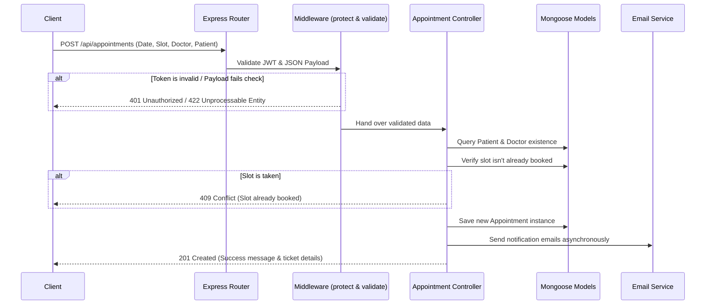

# Vanguard HMS: Master Backend Walkthrough & Review Guide

This document provides a highly detailed walkthrough of the **Vanguard Hospital Management System (HMS) Backend** codebase. Use this to prepare for your HackerEarth technical review, architecture questions, and code discussions.

---

## 1. High-Level Architecture & Design Patterns

The backend is built with **Node.js, Express, and MongoDB (via Mongoose ODM)**. It follows the industry-standard **Model-View-Controller (MVC)** architectural pattern (with Routes acts as the routing layer, Controllers handling the business logic, and Models representing data layers).

### Design Features:
*   **Role-Based Access Control (RBAC):** Users hold array-based roles (e.g., `ADMIN`, `OWNER`, `DOCTOR`, `RECEPTIONIST`, `NURSE`, `PATIENT`) allowing highly secure and modular endpoints.
*   **Ownership Isolation:** Features dynamic multi-tenant filtering using `ownershipFilter.js` to ensure users only modify records they own or have permissions to manage.
*   **Auto-Incrementing IDs:** Utilizes a custom database sequence counter to generate formatted public identifiers like patient `UHID`s.
*   **Security hardening:** Equipped with `helmet` for HTTP headers security, `cors` for cross-origin access control, and bcrypt-based password hashing.

---

## 2. Directory Structure Overview

```
HMS-Backend/
├── server.js                     # Root entry point
└── src/
    ├── server.js                 # Database startup & listening config
    ├── app.js                    # Express application configurations & routing mounts
    ├── config/                   # Configuration files (Database)
    ├── models/                   # Mongoose Database Schemas (Data layer)
    ├── controllers/              # Core business logic handlers
    ├── routes/                   # API Endpoints mapped to controllers & validation rules
    ├── middleware/               # Token validation, RBAC, and payload validation handlers
    ├── utils/                    # Helper scripts (slot generation, email alerts, tokens)
    └── scripts/                  # Seed scripts (creating initial Admin/Owner accounts)
```

---

## 3. Detailed File and Function Explanations

### 📂 Root Files

#### 📄 `server.js` (root)
*   **Purpose:** Simply references and executes the configuration setup in `./src/server.js`. Keeps code modular for production environments.

#### 📄 `src/server.js`
*   **Purpose:** The operational entry point.
*   **Key Functions:**
    *   Loads environment variables using `dotenv`.
    *   Connects to the database by executing `connectDB()`.
    *   Listens to the designated port (defaults to `5000` or `process.env.PORT`).

#### 📄 `src/app.js`
*   **Purpose:** Configures Express middleware, security, global error handlers, and registers the main router groups.
*   **Flow and Logic:**
    1.  Sets up security headers using `helmet()`.
    2.  Logs requests using `morgan('dev')`.
    3.  Enables Cross-Origin Resource Sharing (`cors()`) and handles raw JSON and URL-encoded bodies.
    4.  Registers API routers under path prefixes (e.g., `/api/auth`, `/api/patients`).
    5.  Implements a `/health` endpoint for quick pinging.
    6.  Defines a global catching middleware that intercepts errors, formats them safely, and prevents database or raw stack leaks from being exposed to the client in production.

---

### 📂 Database Configuration (`src/config/`)

#### 📄 `db.js`
*   **Purpose:** Controls connection lifecycles to MongoDB using Mongoose.
*   **Key Functions:**
    *   `connectDB()`: Connects to `MONGO_URI`. Exits gracefully (`process.exit(1)`) if connection fails.
    *   Hooks listeners like `mongoose.connection.on('connected')`, `'error'`, and `'disconnected'` to log runtime status updates.

---

### 📂 Data Models (`src/models/`)

#### 📄 `counterModel.js`
*   **Purpose:** Schema for tracking auto-incrementing numerical sequences (used to generate uniform unique patient identifiers like `UHID`).
*   **Fields:** `id` (string sequence name), `seq` (number value tracking increment).

#### 📄 `userModel.js`
*   **Purpose:** Stores user authentication and permission credentials.
*   **Fields:** `email`, `password` (stored as bcrypt hash), `roles` (array containing roles like `ADMIN`, `DOCTOR`, etc.), `status` (`ACTIVE`/`INACTIVE`), and password reset token trackers.
*   **Methods:** Includes Mongoose hooks (`pre-save`) to automatically hash new/modified passwords, and helper methods like `matchPassword()` for authentication.

#### 📄 `employeeModel.js`
*   **Purpose:** Extends the basic `User` schema to hold hospital staff metadata (especially Doctors).
*   **Fields:** References the matching `userId`, `name`, `phone`, `specialization`, `schedule` (nested tracking of working days, times, and slot duration), and operational `status`.

#### 📄 `patientModel.js`
*   **Purpose:** Patient profile registry.
*   **Fields:** `UHID` (Auto-generated uniform hospital ID), `name`, `phone`, `email`, `gender`, `dob` (date of birth), `medicalHistory`, and `registeredBy` (link to user who created the record).
*   **Key Logic:**
    *   `pre-save` hook checks if the patient already has a `UHID`. If not, it query-increments the sequence counter (`counterModel`) and formats a string like `PAT-00001`.
    *   Contains virtual getters like `age` which calculate and return current age dynamically based on the stored `dob`.

#### 📄 `appointmentModel.js`
*   **Purpose:** Schedules, registers, and tracks hospital patient bookings.
*   **Fields:** Links to `patientId` and `doctorId`, appointment `date`, `timeSlot`, `status` (`PENDING`, `CONFIRMED`, `COMPLETED`, `CANCELLED`), `reason`, `visitType` (`OPD`, `FOLLOW_UP`), and nested billing references.

#### 📄 `billModel.js` & `paymentModel.js`
*   **Purpose:** Manage financials and record individual ledger payments mapped to appointments.

#### 📄 `medicalRecordModel.js`
*   **Purpose:** Keeps track of patient medical histories, clinical vitals (blood pressure, temperature), prescriptions, diagnoses, and notes during patient visits.

---

### 📂 Middleware Layer (`src/middleware/`)

#### 📄 `authMiddleware.js`
*   **Purpose:** Core security guard protecting routes from unauthenticated or unauthorized requests.
*   **Key Middlewares:**
    *   `protect(req, res, next)`: Resolves JWT bearer tokens from request headers. Decodes the token, checks if the user still exists in the DB, verifies that their account `status` is `'ACTIVE'`, and attaches the decoded user object onto `req.user`.
    *   `authorize(...allowedRoles)`: Higher-order route guard. Returns a middleware that validates whether `req.user.roles` intersects with the `allowedRoles` array. Rejects requests with `403 Access Denied` if unauthorized.

#### 📄 `validate.js`
*   **Purpose:** Processes request payload validations declared in routes.
*   **Key Functions:**
    *   `validate(req, res, next)`: Intercepts `validationResult(req)` from `express-validator`. If any data parameters (like invalid emails or short passwords) fail constraints, it returns an structured `422 Unprocessable Entity` containing field-by-field error mappings.

---

### 📂 Controllers (`src/controllers/`)

#### 📄 `authController.js`
*   **Purpose:** User registration, authentication, password reset pipelines.
*   **Key Functions:**
    *   `login`: Verifies user email, tests matching bcrypt passwords, and issues a structured JSON Web Token (JWT).
    *   `registerUser`: Creates standard user entries (often called internally during employee creations).
    *   `forgotPassword` / `resetPassword`: Generates secure crypto reset tokens, saves them with expiry dates to the user model, sends them via email, and resets password structures upon confirmation.

#### 📄 `adminController.js`
*   **Purpose:** Admin-exclusive actions like managing workforce employees and loading core analytics.
*   **Key Functions:**
    *   `createEmployee`: A transactional action that creates a `User` entry first (generating a random password via utilities), and then creates the matching detailed `Employee` schema profile, sending registration emails to the employee.
    *   `getSystemStats`: Performs multi-collection Mongo aggregates to count total active patients, doctors, appointments, and pending registrations.

#### 📄 `employeeController.js`
*   **Purpose:** Manages staff schedule setups and queries.
*   **Key Functions:**
    *   `getDoctors`: Retrieves lists of employees who hold the `DOCTOR` role.
    *   `updateDoctorAvailability`: Updates working hours, schedule intervals, and slot durations for doctors.

#### 📄 `patientController.js`
*   **Purpose:** Handles all patient CRUD operations.
*   **Key Functions:**
    *   `createPatient`: Validates age limits, checks for email conflicts, auto-generates UHID, and persists patient records.
    *   `getAllPatients` / `searchPatients`: Performs paginated queries using search regex patterns on name, phone, email, or UHID, automatically isolated by user ownership where necessary.
    *   `updatePatient` / `deletePatient`: Mutates or removes profile configurations.

#### 📄 `appointmentController.js`
*   **Purpose:** Schedules and manages appointments and billing.
*   **Key Functions:**
    *   `createAppointment`: Schedules an appointment at a specific time, checks if that slot is already taken, and locks it.
    *   `getAppointments`: Fetches appointments, populated with detailed doctor and patient references.

---

### 📂 Routes (`src/routes/`)

Routes bind URL patterns to Controller actions, injecting validations and authorization rules.

*   📄 `authroutes.js`: Maps endpoints like `/login`, `/forgot-password`, `/reset-password` without session constraints.
*   📄 `adminRoutes.js`: Exposes `/employees` (creating, editing, listing) under the `protect` and `authorize('ADMIN', 'OWNER')` guards.
*   📄 `employeeRoutes.js`: Manages doctor schedules, queries, and details.
*   📄 `patientRoutes.js`: Handles `/api/patients` CRUD. Features role-based filters to control which staff types can create, modify, or delete profiles.
*   📄 `appointmentRoutes.js`: Books, reschedules, updates status, and queries slots.

---

### 📂 Utilities (`src/utils/`)

#### 📄 `ownershipFilter.js`
*   **Purpose:** Restricts queries dynamically based on user context to enforce data isolation.
*   **Key Logic:** If the logged-in user is a doctor or receptionist (not an admin or owner), the filter injects `{ registeredBy: req.user.id }` into database queries so they can only see or edit profiles they registered.

#### 📄 `slotGenerator.js`
*   **Purpose:** Splits active working shifts into uniform bookable slots (e.g., 9:00 AM to 5:00 PM in 30-minute blocks), taking lunch breaks and customized time steps into account.

#### 📄 `getAvailableSlots.js`
*   **Purpose:** Cross-references the generated time slots from `slotGenerator` against existing bookings in the `appointmentModel` for a given date. Returns the list of remaining, unbooked slots.

#### 📄 `generateToken.js`
*   **Purpose:** Issues secure JWT access tokens containing user payloads (`id`, `roles`), signed with a private security key.

#### 📄 `passwordGenerator.js`
*   **Purpose:** Generates cryptographically secure random passwords containing letters, numbers, and symbols to assign to newly registered employee profiles.

---

## 4. Key Flow: Creating an Appointment

Here is how data travels through the backend layers when a user schedules a new appointment:


